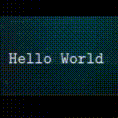

  

***

| My Projects  |
|-------------|
| 1. [Card App](https://card-bek.vercel.app/) |
| 2. [YouTube Clone](https://youtube-bek.vercel.app/) |
| 3. [Translator](https://ng-translate.vercel.app/) | 
| 4. [Weather App](https://weather-app-bek.vercel.app/) |
| 5. [Questions App](https://questions-app-bek.vercel.app/) |
| 6. [Pexels Clone](https://pexels-clone-bek.vercel.app/) |

## Social Links 

***

### Languages and Tools:

